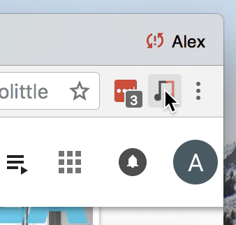

# queue-dedup

A small browser plugin to delete duplicate songs from your Google Play Music queue. This can be useful if you sync a local music library with Play Music, but also subscribe to the streaming service; in this case, you may often have duplicates.

